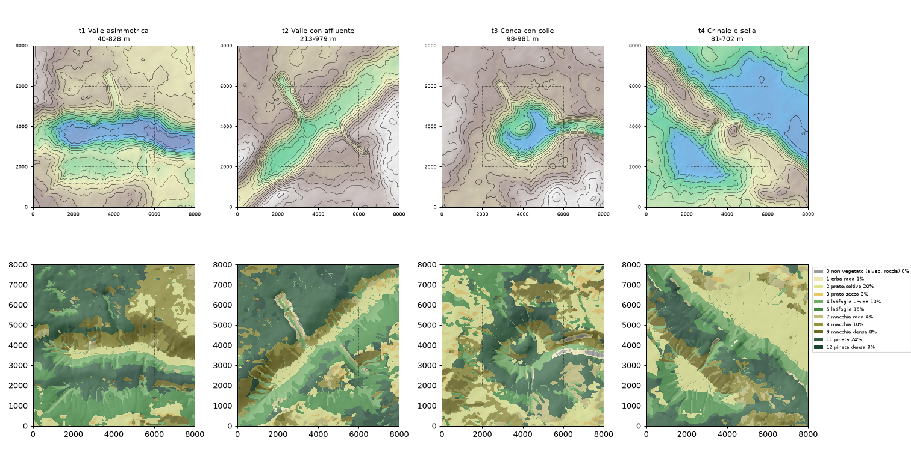

# Fase 1 — Ambiente naturale: resoconto e atlante (8 ottobre 2026, rev. 2)

## 1. Realizzato

- `tools/scenario_factory.py` + `tools/factory/` (Python, numpy + matplotlib, `tools/requirements.txt`):
  - `nature` genera orografia e vegetazione;
  - `fires` esegue gli sweep;
  - `atlas` produce le immagini e le metriche.
- `crates/fire/src/bin/fire_sweep.rs`: runner batch che usa `fire::FireSim` così com'è. Python **non** simula il fuoco.
- **Formato:** ogni candidato è scritto nel formato `Scenario` esistente in `out/factory/data/scenarios/<id>/` (gitignored, rigenerabile). Vettori e popolazione sono vuoti.
- **Rev. 2, su richiesta:** incendi più vivaci e più lunghi, umidità più bassa, nessun incendio al bordo nelle prime ore.
  - **Mondo:** 8 km × 8 km (400 × 400 celle da 20 m). Il paesaggio progettato è il **nucleo centrale di 4 km** (riquadro tratteggiato nelle tavole), dove cadono **tutti gli inneschi**. Attorno c'è una fascia collinare di 2 km.
  - **Vento:** 40 km/h.
  - **Durata:** 6 h simulate.
  - **Umidità:** **3 %**, fissa e uniforme.

## 2. Evidenza

```text
python3 -m venv .venv && .venv/bin/pip install -r tools/requirements.txt
.venv/bin/python tools/scenario_factory.py all      # 4 candidati, 840 incendi da 6 h, ~5 min
```

- **Sweep per candidato:** 7 inneschi (automatici, ≥800 m dentro il nucleo, patch di 60 m) × 8 venti × 3 seed, più 2 cambi di vento a T+60 (O→N, S→E).
- **Determinismo:** rigenerando, i terreni sono bit-identici e gli incendi ripetuti sono identici. `fire_sweep` dà lo stesso risultato con passo 6 s e 60 s.
- **Umidità:** su t2, passare dal 6 % al 3 % aggiunge solo circa il 10–30 % di area nella prima ora. La leva forte è il vento.



| | attecchiti (≥5 ha a 1 h) | ha a 30' | 1 h | 2 h | 3 h | 4 h | 6 h (mediane) | 6 h p10 / p90 | Jaccard fra venti | area cambiata dal cambio di vento |
|---|---|---|---|---|---|---|---|---|---|---|
| **t1** Valle asimmetrica | 89% | 11 | 44 | 169 | 318 | 454 | 615 | 53 / 1188 | 0.11 | 72% |
| **t2** Valle con affluente | 85% | 8 | 20 | 73 | 153 | 288 | 491 | 2 / 1037 | 0.14 | 72% |
| **t3** Conca con colle | 100% | 14 | 62 | 225 | 414 | 618 | 872 | 524 / 1282 | 0.09 | 83% |
| **t4** Crinale e sella | 88% | 11 | 26 | 90 | 192 | 311 | 549 | 79 / 959 | 0.09 | 84% |

**Quando l'incendio tocca il bordo del mondo (8 km), in minuti:**

| | p10 | p25 | mediana | entro 1 h | entro 2 h | entro 6 h |
|---|---|---|---|---|---|---|
| t1 | 103 | 131 | 174 | 0% | 20% | 70% |
| t2 | 105 | 138 | 249 | 1% | 17% | 58% |
| t3 | 108 | 142 | 172 | 0% | 14% | 96% |
| t4 | 144 | 214 | 291 | 0% | 7% | 64% |

**Come leggere le tabelle.**
- **Jaccard basso** (0,09–0,14): direzioni del vento diverse bruciano zone quasi disgiunte.
- **Aree dopo le 2–3 h:** sono sottostimate per gli incendi che raggiungono il bordo.

**Atlante.** Per ogni candidato ci sono quattro tavole:
- `*_terreno`: quota, combustibili e inneschi;
- `*_venti`: da quanti inneschi è raggiunta ogni cella, una mappa per direzione del vento;
- `*_arrivi`: isocrone a 30', 1 h, 2 h, 4 h e 6 h per i due inneschi più sensibili al vento;
- `*_cambio_vento`: lo stesso incendio con e senza rotazione a T+60.

| | terreno | venti | arrivi | cambio vento |
|---|---|---|---|---|
| t1 | [png](t1_terreno.png) | [png](t1_venti.png) | [png](t1_arrivi.png) | [png](t1_cambio_vento.png) |
| t2 | [png](t2_terreno.png) | [png](t2_venti.png) | [png](t2_arrivi.png) | [png](t2_cambio_vento.png) |
| t3 | [png](t3_terreno.png) | [png](t3_venti.png) | [png](t3_arrivi.png) | [png](t3_cambio_vento.png) |
| t4 | [png](t4_terreno.png) | [png](t4_venti.png) | [png](t4_arrivi.png) | [png](t4_cambio_vento.png) |

**Lettura sintetica.**
- **t4:** il fuoco più "lento da uscire": la mediana tocca il bordo dopo quasi 5 ore. Il crinale separa due versanti esposti a venti opposti, quindi è adatto a un dilemma fra due abitati.
- **t2:** l'affluente convoglia gli incendi verso NO o NE a seconda del vento.
- **t1 e t3:** bruciano più in fretta. In t3, con la fascia esterna, la conca è diventata boscosa e brucia molto; ha perso il carattere che aveva a 4 km.

## 3. Non risolto

- **Mondo più grande del diorama:** il kiosk oggi rende scenari da 4 km. Va verificato in fase 5 come inquadrare 8 km, oppure rendere solo il nucleo con la fascia esterna sfumata.
- **Bordo raggiunto comunque:** con 40 km/h e 6 h circa 6 incendi su 10 escono dagli 8 km. Per non toccare mai il bordo servirebbe un mondo di 12–16 km, oppure partite di 2–3 h simulate, che sembrano comunque il range utile per il gioco.
- **Artefatti del terreno da rifinire sul candidato scelto:**
  - i solchi a pettine;
  - in t2, le pareti rocciose dell'affluente, che fanno da tagliafuoco artificiale;
  - in t3, la conca diventata boscosa.
- **Codice vecchio:** i 4 test rossi segnalati nell'audit restano non toccati.

## 4. Passo successivo (checkpoint umano 1)

Scegli **uno o due candidati** (proposta: **t4**, in alternativa **t2**) e la durata simulata della partita. Dopo la conferma: rifinitura del terreno scelto, poi **fase 2**, cioè abitati, strade e aree sicure nel nucleo, con un nuovo sweep.
