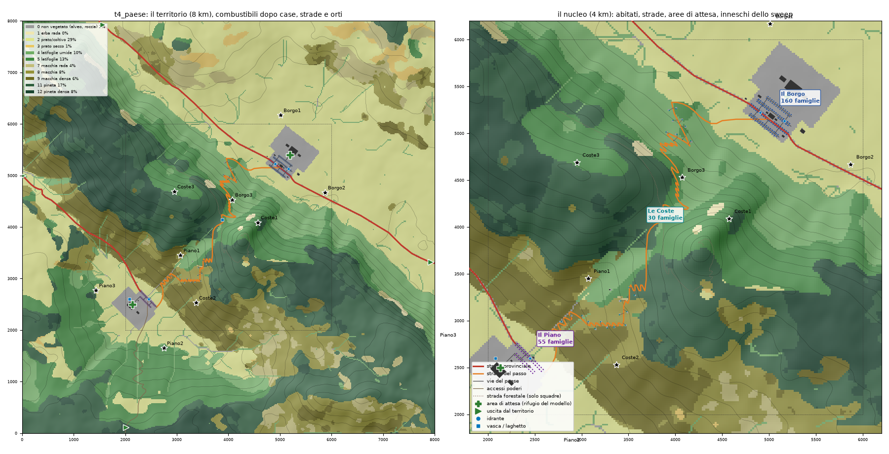

# Fase 2 — Insediamenti su t4: tavola del paese (8 ottobre 2026)

## 1. Realizzato

- `tools/factory/town.py` (comando `build-town`): disegna paesi, strade, aree di attesa, acqua e popolazione su t4 e scrive lo scenario `t4_paese` nel formato `Scenario`. I layout sono dati (`LAYOUTS`).
- `tools/factory/roads.py`: strade tracciate come percorso a costo minimo sul DEM, su celle da 60 m, con penalità sulla pendenza (9 % ideale, 14 % massima). Seguono l'orografia e salgono al valico a tornanti. Gli incroci condividono i vertici.
- `crates/abm/src/bin/scenario_check.rs` (comando `verify`): verifica con il codice del modello caricamento, griglie, legami casa↔famiglia, celle non combustibili, componenti stradali, rifugi scelti dal modello, percorsi auto e a piedi, basi delle unità.
- `tools/factory/plate.py` (comandi `town-fires` e `plate`): sweep sul mondo costruito e sul terreno naturale con **gli stessi inneschi**, tavola e tabella di minaccia.

**Il paese (layout 1).**
- **Il Borgo:** 160 famiglie, compatto, in piano al piede del versante boscoso NE. Ha piazza, chiesa, municipio, scuola, caserma VVF, area di attesa con campo sportivo e orti irrigui sul lato della piana.
- **Il Piano:** 55 famiglie, nucleo di fondovalle nella conca SO, con area di attesa verso la conca.
- **Le Coste:** 30 famiglie in 24 case sparse nella macchia a solatio, lungo la Strada del Passo, ciascuna con il suo accesso.
- **Strade:**
  - SP 12, la provinciale della piana: 8,1 km, uscite a N e a E;
  - Strada del Passo, Borgo → sella → Piano: 7,9 km di tornanti;
  - SP 9 di fondovalle, verso l'uscita a O;
  - Strada del Monte, alternativa verso S;
  - due strade forestali, solo per le squadre.
- **Totale:** 207 edifici, 245 famiglie, 706 persone. Idranti nei paesi, una vasca antincendio alla sella, un laghetto al Piano.

## 2. Evidenza

```text
.venv/bin/python tools/scenario_factory.py build-town --terrain t4 --layout 1
.venv/bin/python tools/scenario_factory.py verify --scenario t4_paese       # exit 0
.venv/bin/python tools/scenario_factory.py town-fires --scenario t4_paese --terrain t4
.venv/bin/python tools/scenario_factory.py plate --scenario t4_paese --terrain t4
```

**`scenario_check`: tutti i controlli superati.**
- Una sola componente stradale con tutte le famiglie.
- **Rifugi scelti dal modello:** le 2 aree di attesa (Borgo e Piano, con lo 0–5 % di combustibile entro 300 m) e 4 uscite.
- 100 % delle famiglie con un percorso in auto verso un rifugio.
- Nessuna casa o famiglia su celle combustibili.



**Minaccia per vento.** Quota di incendi che arrivano entro 150 m dalle case entro 2 h / entro 6 h, con il primo arrivo mediano tra parentesi.
- **Inneschi:** 9, tre attorno a ogni località a circa 1 km e ad almeno 400 m dalle case, × 3 seed.
- **È un proxy di tavola,** non danno alle case.

| località | N | NE | E | SE | S | SO | O | NO |
|---|---|---|---|---|---|---|---|---|
| Il Borgo | 11% / 11% (83') | 11% / 22% (164') | 11% / 11% (71') | 11% / 11% (54') | 0% / 11% (182') | 7% / 7% (88') | 0% / 0% | 0% / 11% (223') |
| Il Piano | 15% / 33% (143') | 19% / 56% (143') | 11% / 26% (179') | 7% / 22% (129') | 11% / 11% (72') | 0% / 22% (193') | 11% / 11% (78') | 0% / 11% (192') |
| Le Coste | 33% / 41% (66') | 41% / 63% (116') | 15% / 52% (182') | 11% / 33% (213') | 41% / 44% (69') | 37% / 63% (81') | 19% / 41% (173') | 15% / 33% (128') |

Tavola per vento: [paese_venti.png](paese_venti.png).

**Mondo costruito contro terreno naturale** (stessi inneschi, venti e seed, 216 incendi):
- **Area a 2 h:** mediana 65 ha contro 85 ha, per effetto di provinciale, paesi e orti.
- **Area a 6 h:** rapporto mediano 0,98.

**Lettura.**
- **Le Coste** è la località più esposta: minacciata con quasi ogni vento, spesso entro 1–1,5 h.
- **Il Piano** è minacciato soprattutto con N e NE, cioè con il fuoco che scende dal versante.
- **Il Borgo** è protetto da campi irrigui e piana: è raggiunto solo da inneschi vicini a monte, con N, NE ed E.
- **Compromessi già visibili:** con NE sono minacciati sia Le Coste sia Il Piano, dai due lati della strada del passo. Con N sono minacciati Borgo e Coste insieme.

## 3. Non risolto

- **Strade come tagliafuoco:** dipingere tutte le strade come celle non combustibili da 20 m riduceva di un terzo l'area a 2 h. I tornanti del passo facevano da barriera artificiale. Ora sono non combustibili solo la provinciale e le vie del paese. È un'ipotesi da rivedere con la risoluzione fine.
- **Il Borgo poco esposto:** gli orti irrigui (ipotesi necessaria perché il modello trovi un'area di attesa) e la piana lo proteggono. Se serve più tensione, si possono ridurre gli orti sul lato SO o portare il bosco più vicino al margine.
- **Grafica delle strade:** la Strada del Passo ha pendenze p95 del 25 % sul DEM a 20 m, perché il draping segue il terreno e non c'è un rilevato stradale, e ha un tratto rettilineo artificiale verso y ≈ 2950. Da rifinire insieme al DTM fine.
- **Popolazione:** sono ancora i tratti "compiacenti" del vecchio `demo_traits`. Vanno ripensati in fase 3 con la preallerta.
- **Basi delle squadre:** il modello le mette sui rifugi, comprese le uscite a 2–3 km dal nucleo. Il roster (oggi 3 + 3 + 2) e le basi vanno decisi in fase 3.
- **Kiosk:** non ho provato lo scenario nel kiosk Bevy (8 km, mai provato).

## 4. Passo successivo (checkpoint umano 2)

Approva il layout o chiedi piccole modifiche, per esempio: Borgo più esposto, meno orti, Coste più vicine al bosco, passo più corto. Dopo la conferma, la proposta (da `docs/TODO.md`) è pianificare la **risoluzione fine** (DTM, strade, case e render più fini della griglia del fuoco da 20 m) prima della fase 3, perché cambia geometrie, distanze ed ETA su cui il coordinatore verrà tarato.
