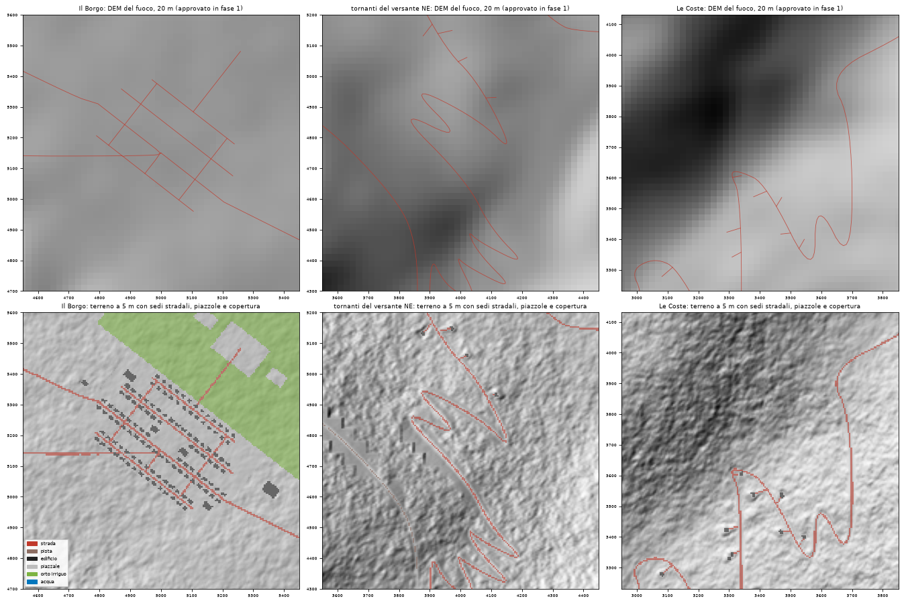

# Risoluzione fine: terreno a 5 m per grafica e agenti (8 ottobre 2026)

## 1. Realizzato

**Il fuoco resta com'era (decisione dell'utente, 2026-10-08).** Il propagatore usa lo stesso DEM a 20 m approvato in fase 1, identico bit per bit (`dem.f64`), e il combustibile a 20 m deciso da `town.build`. La risoluzione fine serve solo a grafica e agenti: quote, pendenze, draping e sede stradale.

- **`tools/factory/fine.py`** (eseguito da `build-town`; con `--coarse` si torna al render a 20 m):
  - **terreno a 5 m:** 1601 × 1601 nodi, ottenuti ricampionando il DEM a 20 m con una spline cubica e aggiungendo micro-rilievo (8–160 m, ±1–2 m, più forte sui versanti);
  - **sedi stradali:** profilo longitudinale a pendenza limitata per classe (provinciale 10 %, passo 14 %, forestali 22 %), piattaforma in piano larga 6 m per lato (3,5 per le piste), più larga della carreggiata perché il kiosk disegna le strade come simboli da 4 + 1,6 m, e scarpate 1:0,7 verso il terreno;
  - **piazzole:** in piano sotto ogni edificio;
  - **copertura del suolo a 5 m:** `cover.u8` con naturale, strada, pista, edificio, piazzale, orto irriguo e acqua, ricavata dagli stessi vettori di `osm.json`.
- **`render_terrain.f32`** è ora a 5 m. Il formato e il loader (`scenario::Terrain`) lo prevedevano già, quindi il codice Rust non cambia.
- **`roads.py`:** il router tiene conto anche della direzione di marcia, con un costo per le curve e uno aggiuntivo per i tornanti. A 5 m il vecchio percorso mostrava una **sega di micro-tornanti** da 40–60 m: era il "rettilineo artificiale" verso y ≈ 2950, invisibile a 20 m. Un punto di passaggio in `T4_L1`, (3350, 2950), tiene la Strada del Passo nel corridoio approvato, sul versante a solatio con Le Coste. Senza, il router sceglie una deviazione di 10,4 km verso S.
- **`fineplate.py`** (comando `fine-plate`): tavole e metriche qui sotto. Lo sweep della fase 2 è conservato come `out/factory/fires/t4_paese_fase2`.

## 2. Evidenza

```text
.venv/bin/pip install -r tools/requirements.txt          # + scipy
.venv/bin/python tools/scenario_factory.py build-town     # ~8 s, terreno fine incluso
.venv/bin/python tools/scenario_factory.py verify         # tutti i 10 controlli OK
.venv/bin/python tools/scenario_factory.py town-fires --ignitions-from t4_paese_fase2
.venv/bin/python tools/scenario_factory.py fine-plate
```



**Strade sul terreno a 5 m:**

| strada | lunghezza | pendenza p95 della sede | sterro/riporto p95 / max |
|---|---|---|---|
| SP 12 della Valle | 8,1 km | 7 % | 1,2 / 3,2 m |
| Strada del Passo | 8,9 km (era 7,9) | 14 % (era 25 % sul DEM a 20 m) | 3,2 / 8,7 m |
| SP 9 di Fondovalle | 3,3 km | 10 % | 1,9 / 4,0 m |
| Strada del Monte | 3,6 km | 13 % | 1,5 / 3,1 m |

Profilo del passo: [profilo_passo.png](profilo_passo.png).

- **Coerenza delle due superfici:** la media del terreno a 5 m su ogni cella da 20 m dista 0,9 m in media dal DEM del fuoco (p99 3,7 m, max 9,8 m, sulle sedi stradali).
- **Kiosk Bevy** (verificato da un subagente, senza modifiche al codice):
  - carica `t4_paese` in meno di un secondo;
  - il terreno conta 2,56 M vertici in 169 blocchi, con 176 k piante;
  - 60 FPS stabili su M4 Pro, nessun warning;
  - il passo appare come una strada continua con tornanti puliti, dove prima era una spezzata;
  - **primi piani** (zoom 0,15 su tornanti, Le Coste e Borgo): nastri senza interruzioni all'apice dei tornanti, senza galleggiare né affondare, e case sedute sulle piazzole;
  - **bordi frastagliati dei nastri:** la sede piana era più stretta del simbolo stradale. Allargata la piattaforma (sopra), i bordi sono netti: [kiosk_coste.png](kiosk_coste.png). Le Coste, zoom ravvicinato, con innesco e testi ancora di `demo_borgo`.

**Incendi, fase 2 contro ora** (stessi 9 inneschi, venti e seed, 270 incendi; [confronto_incendi.png](confronto_incendi.png)):
- Il DEM del fuoco è identico. Cambiano 986 celle di combustibile su 160 000: case de Le Coste ricollocate e tracciato delle provinciali.
- **Area a 6 h:** rapporto mediano 1,00 (p10–p90 0,94–1,14). Sovrapposizione mediana delle aree bruciate 0,84.
- **Unico caso che cambia davvero: Borgo2 con vento da N.**
  - In fase 2 la SP 12, dipinta come tagliafuoco largo 20 m, lo fermava a circa 25 ha; ora le faville la saltano e l'incendio arriva a circa 850 ha.
  - È un caso al limite, e conferma che una strada larga una cella è un tagliafuoco fragile.

**Minaccia entro 2 h** (fase 2 → ora, solo dove cambia; tabella completa in `minaccia.md`):

| località | N | NE | E | SE | S | SO | O | NO |
|---|---|---|---|---|---|---|---|---|
| Il Borgo | 11 | 11 | 11 | 11 | 0 | 7 | 0 | 0 |
| Il Piano | 15 | 19 | 11 | 7 → 4 | 11 | 0 | 11 | 0 |
| Le Coste | 33 → 44 | 41 → 52 | 15 → 22 | 11 → 22 | 41 | 37 | 19 → 15 | 15 → 22 |

Le Coste è un po' più esposta perché le sue 24 case seguono il nuovo tracciato.

## 3. Non risolto

- **Effetti sui sistemi di gioco:**
  - posizioni e reti restano in metri e i link stradali seguono la nuova geometria (`scenario_check` OK, 100 % dei percorsi);
  - rifugi e ETA vanno ritarati in fase 3 sul passo da 8,9 km;
  - le quote degli agenti (`Terrain::height_at`) ora seguono sedi e piazzole;
  - la pendenza fuori strada (`slope_deg_at`) include il micro-rilievo.
- **Il kiosk legge ancora il suolo dal combustibile a 20 m:**
  - le piante sono disposte per cella da 20 m;
  - il colore del terreno (`terrain_mesh::cover_tint`) dipinge come pavimentazione ogni cella non combustibile, il che spiega le **macchie chiare a cuneo attorno alle case de Le Coste** nei primi piani;
  - `cover.u8` risolve entrambe le cose: è il prossimo collegamento lato Rust (`scenario`, `vegetation.rs`, `terrain_mesh.rs`).
- **Kiosk:** mostra ancora innesco, vento e testi di `demo_borgo`, perché i paesi sono cablati in `demo::ALL`. Da sostituire in fase 3.
- **Celle a 20 m:** 768 celle non combustibili a 20 m sono per lo più vegetazione a 5 m (case sparse de Le Coste e confini degli orti). È la scelta prudente di tenere case e famiglie su celle non combustibili. Va tenuta presente per l'esposizione.

## 4. Passo successivo (checkpoint)

Approva il terreno fine e il passo ritracciato (8,9 km, stesso corridoio). Poi, prima della fase 3, propongo di collegare `cover.u8` al kiosk: niente piante su strade, case e orti, e colore del suolo dalla copertura a 5 m.
