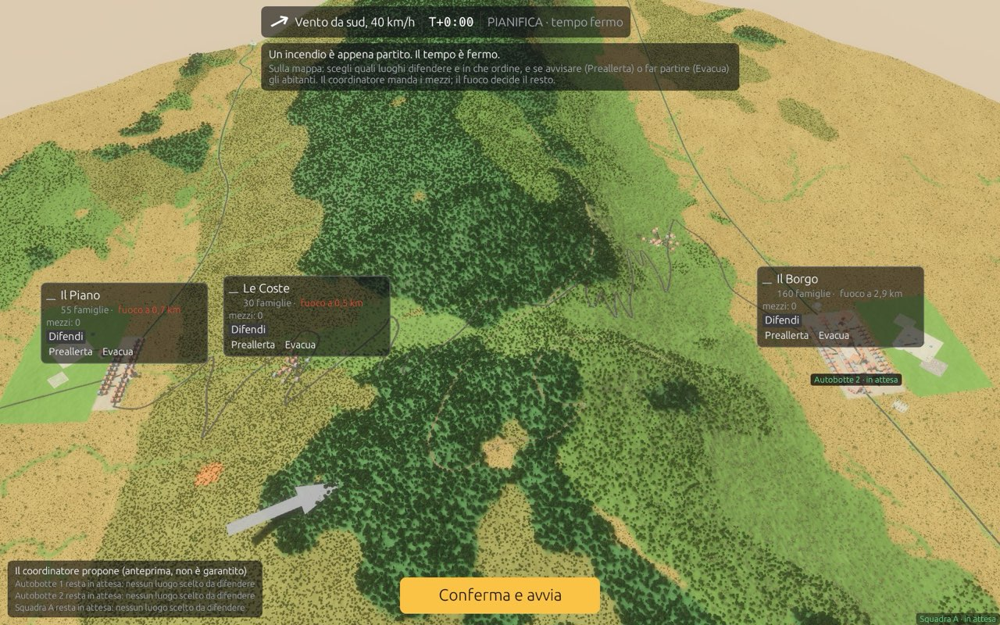
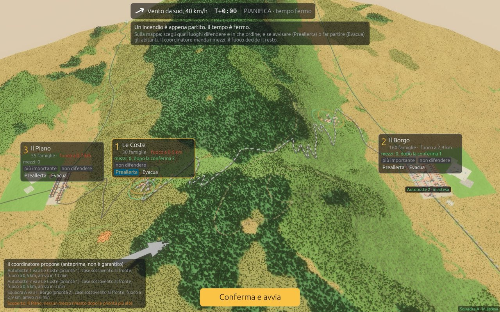
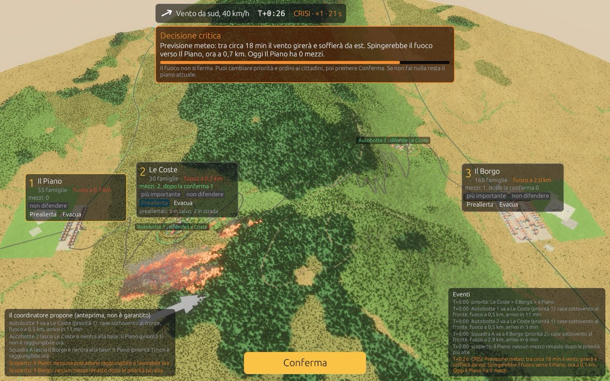
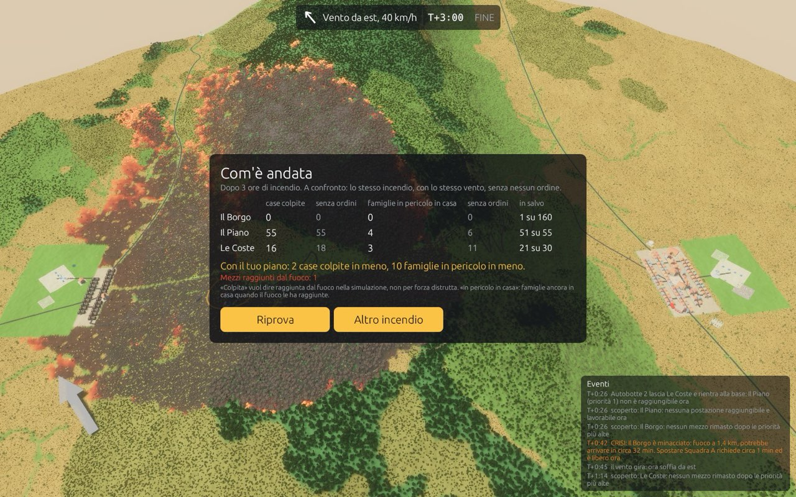
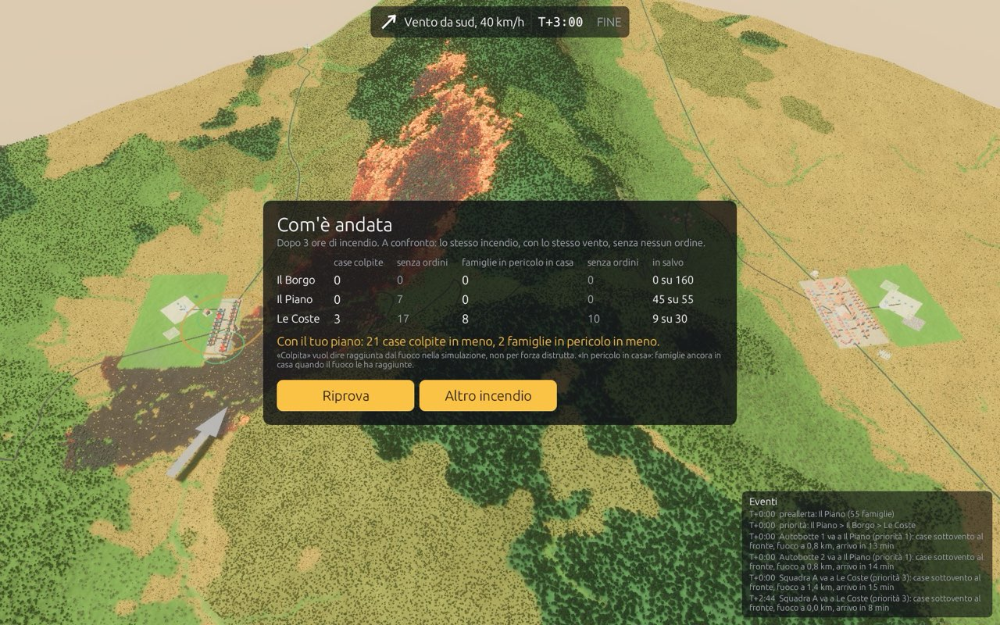
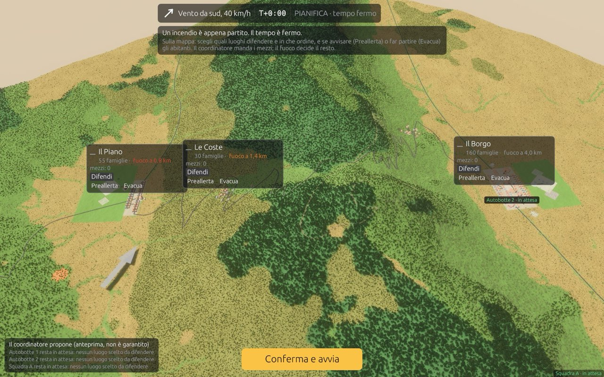
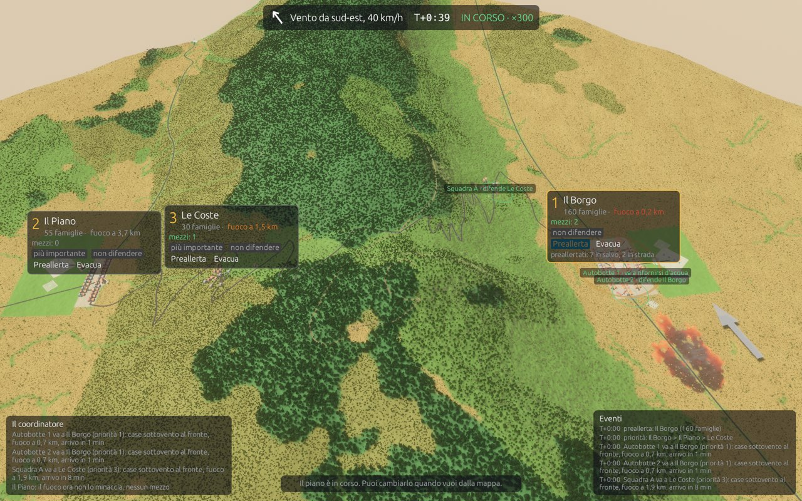

# Fase 5: nuova UX del kiosk (8 ottobre 2026)

## 1. Realizzato

- **La mappa è lo schermo** (`crates/game/src/kiosk/ui.rs`, riscritto). Sulla mappa:
  - una **scheda per quartiere**: posizione in classifica, distanza del fuoco (rossa sotto 1 km), mezzi attuali e dopo la conferma, i pulsanti «Difendi» / «più importante» / «non difendere» e **Preallerta** / **Evacua**; dopo l'ordine mostra chi è in salvo e chi è in strada;
  - un'**etichetta per ogni mezzo**, con lo stato in italiano («verso Le Coste, 4 min», «difende Il Borgo», «va a rifornirsi d'acqua», «bloccato: strada tagliata dal fuoco», «fuori servizio»).
- **In alto:** vento (con freccia orientata sullo schermo), orologio e fase (PIANIFICA · tempo fermo / IN CORSO · ×20 / CRISI · ×1 con i secondi). Sotto compare il consiglio di partenza oppure il **riquadro della crisi**, con la barra del countdown.
- **Pulsante unico** in basso al centro: «Conferma e avvia», «Conferma il nuovo piano», «Conferma», oppure «Continua con il piano attuale».
- **Ai lati in basso:**
  - a sinistra, che cosa propone il coordinatore e perché, segnalato come **anteprima, non garantita**;
  - a destra, gli ultimi eventi.
- **Rotte in 3D** (`overlays::update_routes`, `rings::path_mesh`):
  - verde pieno: la strada che il mezzo sta percorrendo;
  - bianco tratteggiato con anello bianco: lo spostamento proposto, non ancora confermato.
  - Gli anelli dei civili ora sono uno per nucleo, non uno enorme sopra i 4 nuclei de Le Coste.
  - Rimossi i birilli dei focolai secondari: erano decine di marker per un'azione che il giocatore non può compiere.
- **Debrief:**
  - per quartiere: case colpite, famiglie in pericolo in casa, famiglie in salvo;
  - confronto con **lo stesso incendio senza ordini**, calcolato in parallelo da `Game::without_orders`;
  - una frase con l'effetto della scelta e la spiegazione di «colpita»;
  - pulsanti **Riprova** e **Altro incendio**.
- **Operatore:** la barra si apre con **F2** (caso, seme, velocità, nuova partita, pausa). Nessun reset per inattività.
- **I tre casi del kiosk** stanno in `game.json` (`featured`, scritto anche da `cases.py`): Coste2_gira, Piano2, Borgo2. Gli altri restano disponibili all'operatore.
- **Inquadratura:**
  - calcolata, uguale per ogni caso: la distanza più vicina, ruotando la camera di ±50°, che tiene tutte le case e l'innesco nella zona libera dello schermo;
  - corretto un bug della fase 4: l'inquadratura iniziale non scattava mai.
- **Motore** (`rocca`), come dati per l'interfaccia, senza nuove regole:
  - `Post.route`;
  - `Proposal.idle`, cioè chi resta senza postazione e perché;
  - `Game::unit_status`, con «bloccato» se un mezzo non si muove da 5 min;
  - `Game::without_orders`;
  - `Suppression::route_points`;
  - `words::{km, compass}`, con decimali con la virgola e venti a parole.
- **Crisi:**
  - un quartiere scoperto è crisi solo se il fuoco può arrivare entro 45 min;
  - nessuna crisi negli ultimi 10 min di partita (prima ne usciva una a T+3:00, «arrivo in 308 min»).
- **Vegetazione a metà densità** (tua richiesta). `KIOSK_VEG_DENSITY` la regola.

## 2. Evidenza

```text
cargo test --release --workspace                                   # 35 target verdi
KIOSK_CASE=Coste2_gira KIOSK_SPEED=300 KIOSK_WINDOWED=1 KIOSK_SHOT=<dir> target/release/game
KIOSK_FPS=1 KIOSK_WINDOWED=1 target/release/game                   # FPS nel log
```

La partita scriptata (`KIOSK_SHOT`) va da pianificazione e anteprima a esecuzione, crisi (con Il Piano messo in testa), fine e «Altro incendio»:

| | |
|---|---|
|  Pianifica |  Anteprima: rotte tratteggiate |
|  Crisi ×1 |  Debrief |
|  Piano2: 21 case in meno |  Dopo «Altro incendio», scena pulita |
|  Borgo2 in corso: schede separate | |

**FPS** (Apple M4 Pro, finestra 1600×1000, Retina):

| configurazione | FPS |
|---|---|
| prima | 24 (fase 4: 28) |
| vegetazione dimezzata | **40** |

Non dipende dalla risoluzione (stessi FPS a 1 pixel per punto), ma da quanta vegetazione è in vista.

**Risultati headless invariati:**
- `ab_sweep` è identico al rapporto della fase 4;
- `crisi` dà gli stessi esiti (Coste2_gira: 71 / 58 / 71 / 58). Cambiano solo gli orari di 3 crisi secondarie (Coste1, Coste3, Coste3_gira), per la soglia dei 45 min ([crisi.md](../fase4/crisi.md) rigenerato).

## 3. Non risolto

- **Coordinatore alla crisi di Coste2_gira:** con Il Piano in testa, un'autobotte lascia Le Coste e rientra alla base, perché Il Piano non è raggiungibile in quel momento. Ora è spiegato a schermo. Ho provato a mandarla invece al quartiere successivo: l'effetto della crisi spariva (58 → 71 case colpite), perché è il rientro a renderla utile dopo. Ho annullato la prova.
- **Schede e fuoco:** le schede ora si separano tra loro e le etichette dei mezzi si impilano; una scheda può però ancora coprire il fuoco.
- **FPS:** prestazioni non ottimizzate, come richiesto; da rivedere in fase 6 sulla macchina del chiosco.
- **Non visto da una persona al mouse:** primo approccio, leggibilità delle schede a ×20 e tempo di pianificazione (oggi senza limite).

## 4. Passo successivo (checkpoint 5)

Prova al chiosco con te o un collega: una partita per caso, guardando se la prima azione è intuitiva e se il debrief si capisce. Poi la fase 6, il playtest con studenti.
