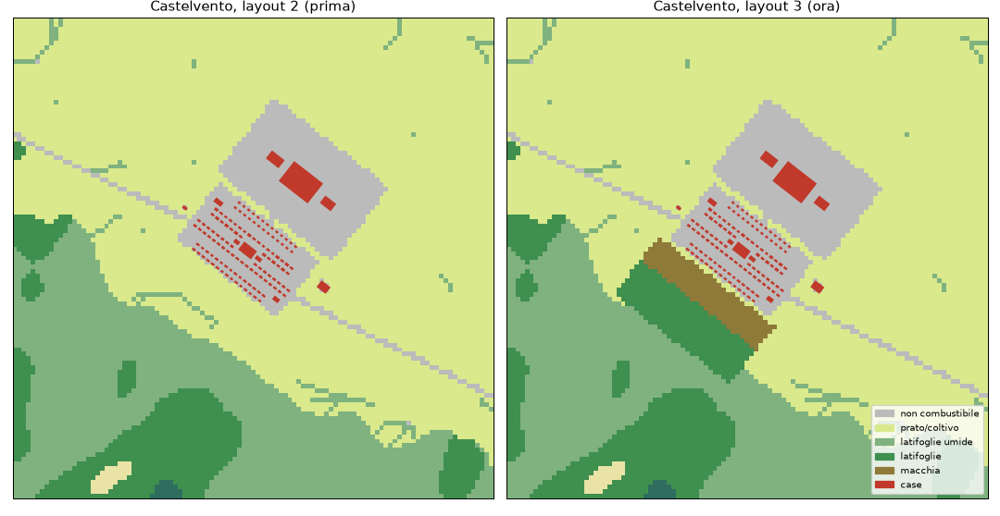

# Layout 3: macchia e bosco al margine di Castelvento (9 ottobre 2026)

Richiesta dell'utente («Procedi», 2026-10-09): far sì che Castelvento possa davvero essere colpito.

## 1. Cosa cambia

- `tools/factory/town.py`: nuovo campo `Settlement.wild` (terreno incolto, dipinto nel combustibile prima di centro, orti, strade e case) e `T4_L3`. Sul lato sud-ovest di Castelvento, per 640 m lungo il paese:
  - macchia (fuel 8) da 20 m a 150 m dal bordo del centro abitato (terrazzamenti abbandonati);
  - latifoglie (fuel 5) per altri 190 m, fino al bosco esistente.
- Pubblicato con `build-town --layout 3`, `town-fires --scenario t4_paese3 --ignitions-from t4_paese2`, `publish --scenario t4_paese3`. Rispetto al layout 2 cambia **solo `fuel.i32`** (513 celle su 160 000): case, strade, popolazione, terreno, copertura e i 18 casi restano identici.
- Corretti i nomi dei quartieri negli sweep generati (`out/factory/fires/*/sweep.json`, non versionati): avevano ancora i vecchi nomi, e questo falsava la scelta della località nei casi `_gira` al momento di ripubblicare.



## 2. Misure (stesso codice, stesso seme, prima/dopo)

**Correzione:** la nota in TODO («0 case colpite in tutti i 18 casi») era sbagliata. Già con il layout 2 Castelvento perdeva case in Borgo2 (31 senza difesa) e in Borgo1 (3); negli altri 16 casi 0.

| Castelvento | layout 2 | layout 3 |
|---|---|---|
| Borgo2, nessuna difesa: case colpite / famiglie colte in casa | 31 / 6 | 33 / 14 |
| Borgo2, con difesa (4 piani A/B): colte in casa | 2–6 | 14–18 |
| Borgo2, Castelvento primo, **nessun ordine** ai civili | 6 / 5 | 6 / 18 |
| idem + preallerta a T+0 / evacua a T+0 / evacua a T+40′ | 0 / 0 / 2 | 3 / 3 / 5 |
| Borgo2, case con minaccia > 0 / ≥ 0,12 (allarme) | 56 / 12 | 100 / 24 |
| Piano2_gira, Pian dei Grilli primo: colte in casa | 0 | 24 |

- **Effetto principale:** in Borgo2, caso del kiosk, ordinare preallerta o evacuazione a Castelvento ora salva 15 famiglie, non più 5. Il caso resta recuperabile: il debrief dello script mostra 0 famiglie in casa e 10 case colpite, contro 14 e 33 senza ordini (`img/borgo2_layout3_fine.jpg`).
- **Invariati:** Coste2_gira e Piano2 (gli altri due casi del kiosk) e 14 dei 18 casi. Cambiano di poco Borgo1_gira (+1 casa a Le Ghiande) e Borgo2_gira (meno di 2 case).
- **Rapporti rigenerati:** `docs/fase4/ab_sweep.md`, `crisi.md`, `porta.md`.

## 3. Non risolto

- **Borgo3** (innesco 1,1 km a sud-ovest, vento da sud-ovest) resta a 0. Il fuoco attraversa 600 m di latifoglie umide (fuel 4) e brucia 11 ha in 3 h (32 ha in 6 h senza squadre). Ho provato a estendere le latifoglie secche fino a 750 m dal paese: nessun cambiamento, quindi la prova è annullata. È la fisica del modello: non la tocco.
- **Castelvento è minacciato solo dai fronti d'erba da est e sud-est** (Borgo2). Un caso con innesco nella macchia a sud-ovest richiederebbe un nuovo innesco nello sweep: va deciso con te.

```text
cargo run --release -p rocca --example ab_sweep    # e crisi, porta
target/release/rocca Borgo2 --priorita Castelvento --civili 0:Castelvento=e
```
