# Iterazione 5b: velocità, vegetazione leggibile, correzioni del playtest 2

Stato: **punti 1–9 fatti** (`docs/TODO.md`). Resta il playtest automatico 3 con gli stessi quattro personaggi.

## 1. Velocità tra i turni

- Velocità portata a **×40, ×120 nei tratti quieti**. Crisi a ×1 e countdown invariati (`crates/game/src/kiosk/mod.rs`).
- Tempo di esecuzione dimezzato (`docs/fase5/durata.md`):

| caso | prima (×20/×60) | dopo (×40/×120) |
|---|---|---|
| Coste2_gira | 5,8 min | 3,3 min |
| Piano2 | 3,6 min | 1,8 min |
| Borgo2 | 4,1 min | 2,1 min |

- **Corretto un difetto** in `Sim::tick` (`crates/game/src/sim.rs`): con frame lunghi si eseguivano step oltre la crisi, che arrivava a T+26:42 invece di T+26:06, e oltre la fine del caso.
  - Ora il frame si ferma sullo step che apre una crisi.
  - Prova: `cargo test --release -p game sim::`. Lo stesso gioco a ×20 e a ×120, con frame da 1/40 s, 0,25 s e 84 s simulati, dà crisi e esito identici. Senza la correzione il test fallisce.
- FPS uguali a ×0 e a ×120. Nessuna frase dei personaggi persa.

## 2. Vegetazione riconoscibile (solo grafica)

| gruppo | prima | dopo |
|---|---|---|
| Pineta (11–12) | `pine`, simile all'`oak`; 18 % di cipressi | pino marittimo: fusto alto, nudo, leggermente inclinato e rossastro; chioma a ombrello piatta e irregolare, verde scuro-bluastro. Niente cipressi. |
| Latifoglie (4–5) | `oak` e olivi (tutta la classe 4) | castagno: fusto corto, chioma grande, tonda e lobata, verde medio brillante. Classe 4 più verde e un po' più fitta. |
| Macchia (7–9) | `bush` verde scuro | cespugli bassi e senza fusto, verde oliva. Densità da 0,75× (classe 7) a 1,15× (classe 9). |
| Prateria (1–3) | erba quasi color suolo | paglierina; classe 3 più chiara e dorata. Alberi isolati invariati. |
| Suolo | tinte tenui | tinta del gruppo, più chiara, sfumata come prima (bilineare e deformata). |

- **File:** `scripts/build_models.py`, rigenerato in Blender: `assets/models/meshes.json`, `.blend` e `preview.png`. Poi `crates/game/src/vegetation.rs`, `terrain_mesh.rs` e `models.rs` (budget del castagno nel test).
- **Budget:**
  - piante: 550 983 contro 551 493 prima, densità invariata;
  - triangoli: 32,4 M contro 34,0 M;
  - modelli: pino 112 triangoli, castagno 156, cespuglio 100.
- **FPS nativi** (M4 Pro, finestra 3200×2000, pianificazione): mediana 32 dopo, 30 prima.

Vista generale, prima e dopo:

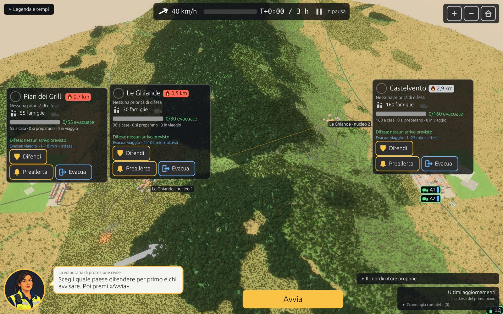
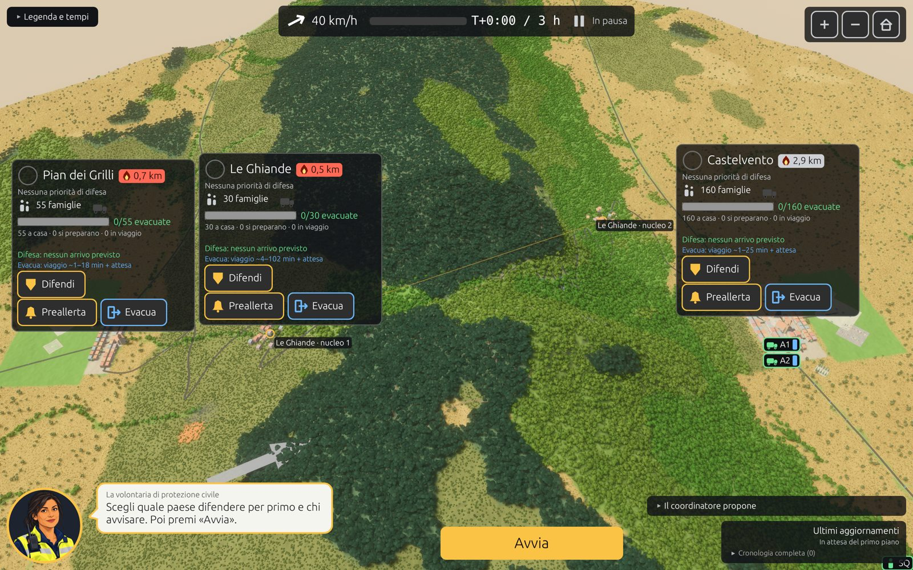

Da vicino (pineta, castagneto, prato), prima e dopo:

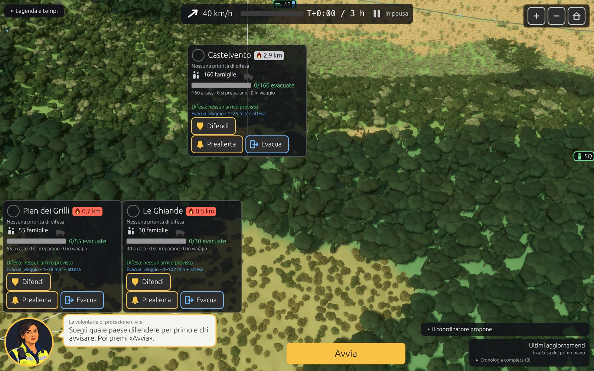
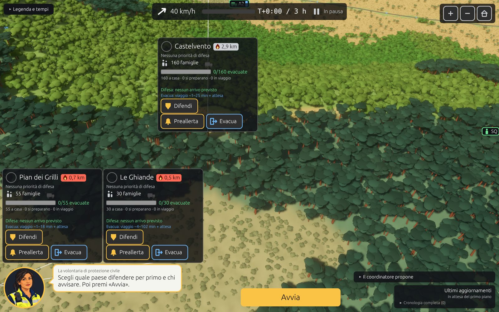

Macchia e prato, prima e dopo:

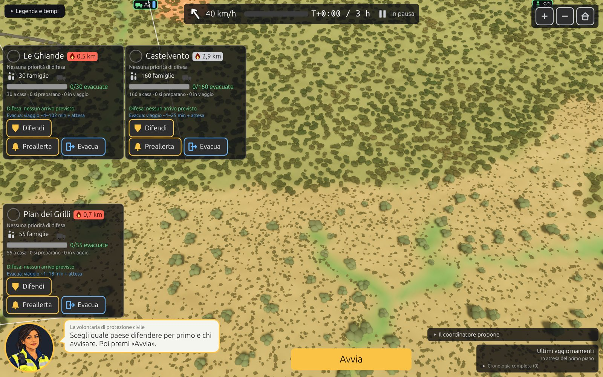
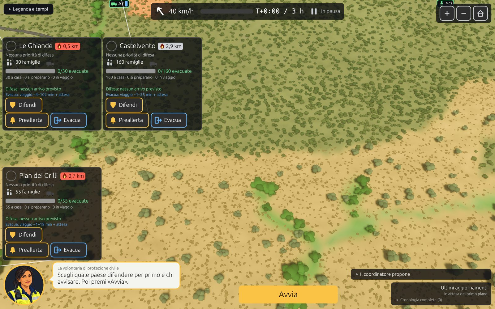

Browser (12 % di vegetazione):

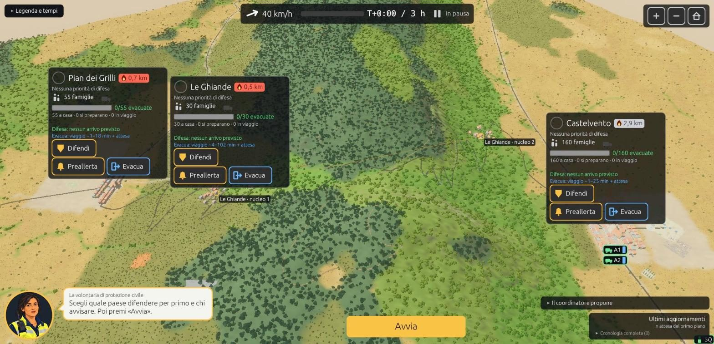

## 6 (parte). Legenda

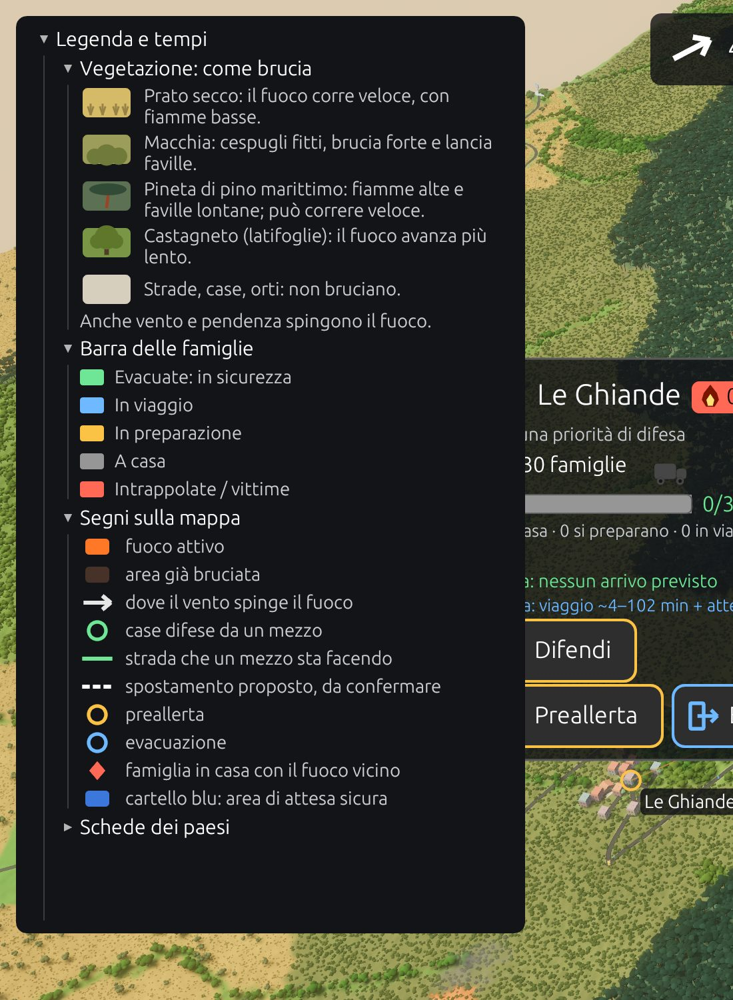

- La legenda è divisa in sezioni apribili. In cima ci sono «Vegetazione: come brucia» e «Barra delle famiglie», poi «Segni sulla mappa»; «Schede dei paesi» è chiusa.
- Ogni tipo di vegetazione ha una miniatura con la stessa sagoma della mappa e colori campionati dalle schermate.
- Ogni tipo dice perché conta, secondo la tabella `data/fuels_eu12.json`:
  - erba: 120 m/h, senza faville;
  - macchia: 140 m/h, con faville;
  - pineta: 200 m/h, con faville;
  - latifoglie: nel territorio avanzano lente (fase 2: Borgo3, 11 ha in 3 h).
- «senza via» diventa «famiglie senza via». Il testo dei tempi dice ×40.
- `KIOSK_LEGEND=1` apre la legenda all'avvio, per le schermate.

## 3–4. Stima d'arrivo dallo stato reale, con il motivo

- **Durante Esegui** (piano invariato), la riga «Difesa» della scheda viene da `rocca::Game::arrivals`, che legge lo stato dei mezzi assegnati al paese:
  - «1 mezzo in postazione»;
  - «1 mezzo in arrivo ~5 min», con i minuti rimasti sul percorso che il mezzo sta facendo;
  - «1 mezzo bloccato dal fuoco»;
  - «A1 si ritira: troppo pericoloso».
- **Quando c'è un piano da confermare** (Pianifica, Crisi, «Pausa e modifica piano») resta l'anteprima del coordinatore. Aggiunge chi verrà richiamato, per esempio «Squadra A tornerà alla base».
- **Senza mezzi**, la riga dice perché, con le parole del coordinatore:
  - «non è tra le priorità»;
  - «nessun mezzo rimasto dopo le priorità più alte»;
  - «nessuna postazione raggiungibile e sicura ora»;
  - «nessun mezzo ora, il fuoco non minaccia ancora».
- Un intervallo con estremi uguali si scrive «~2 min».
- **Prova:** test `fase3::arrivals_follow_the_units`. Un mezzo inviato alla prima priorità è prima in arrivo, con minuti che non crescono, poi in postazione.
- **Punto 9 (parte):** «1 mezzo su 2» nel coordinatore e «Resta 1 mezzo» nella crisi del mezzo perso.

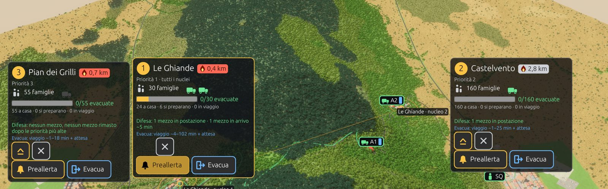
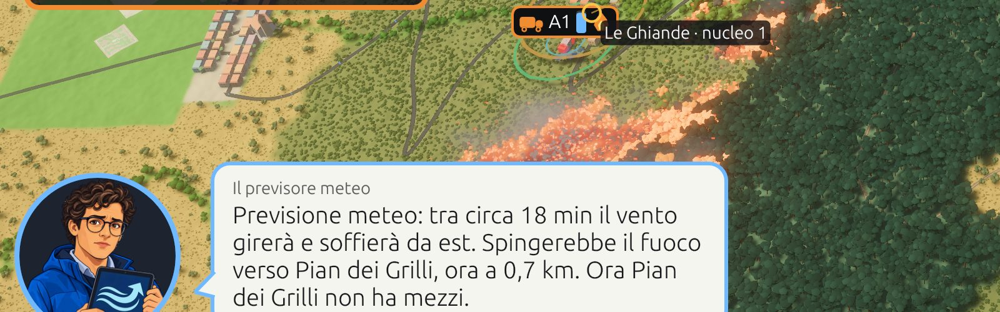

## 5. Debrief con il perché

- Accanto alle barre delle evacuate c'è il conteggio X/Y.
- Il consiglio fisso della volontaria lascia il posto a «Perché»: 2–3 righe per paese da `rocca::Game::story`. Righe:
  - l'ordine alla popolazione, con l'ora, e quante famiglie sono partite e in quanto tempo (metà entro N min);
  - per quanto tempo il paese ha avuto mezzi in postazione, oppure perché non ne ha avuti;
  - quando il fuoco ha raggiunto famiglie ancora in casa.
- Il motore ora registra tre fatti, senza regole nuove: l'ora di partenza di ogni famiglia, l'ora degli ordini per paese e il tempo con mezzi in postazione per paese.
- La frase sulla realtà («quando arriva l'ordine di evacuazione si parte subito») resta come nota in fondo: è un'indicazione di sicurezza, non un consiglio di gioco.
- **Prove:**
  - test `fase3::the_story_tells_what_happened`;
  - tabella per i tre casi e tre piani in `docs/fase5/debrief_righe.md`. In Coste2_gira, a Le Ghiande, le famiglie colte in casa sono 9 senza ordini, 1 con la preallerta e 3 con l'evacuazione.

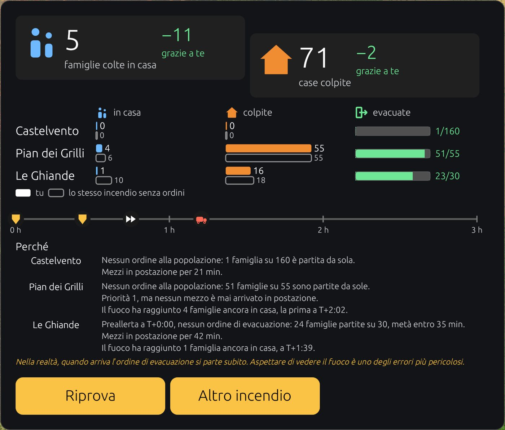

## 7. Schede che si coprono

- **Schede compatte durante Esegui** (piano invariato). Ogni scheda mostra nome, distanza del fuoco, famiglie, mezzi, barra con X/Y e la riga «Difesa»: 175 punti di altezza invece di 350.
- Le collisioni si calcolano sulla dimensione compatta. Così le tre schede non si coprono né alla vista iniziale né più lontano (zoom ×1,8).
- **La scheda sotto il puntatore si apre** verso il basso, in primo piano, con pulsanti e righe complete. Il punto sotto il puntatore non si sposta.
- Appena c'è un piano da confermare (un pulsante premuto, una crisi, la pausa), tutte le schede tornano complete.
- Indicazione in basso: «Passa sopra una scheda per gli ordini».
- **Leggibilità:**
  - fondo delle schede più opaco (alfa 250/255);
  - righe secondarie («a casa · si preparano · in viaggio», viaggio dell'evacuazione) da 13 a 14 punti.
- **Verifica:** schermate native a zoom 1 e 1,8; nel browser, la scheda di Le Ghiande aperta passando sopra con il mouse.

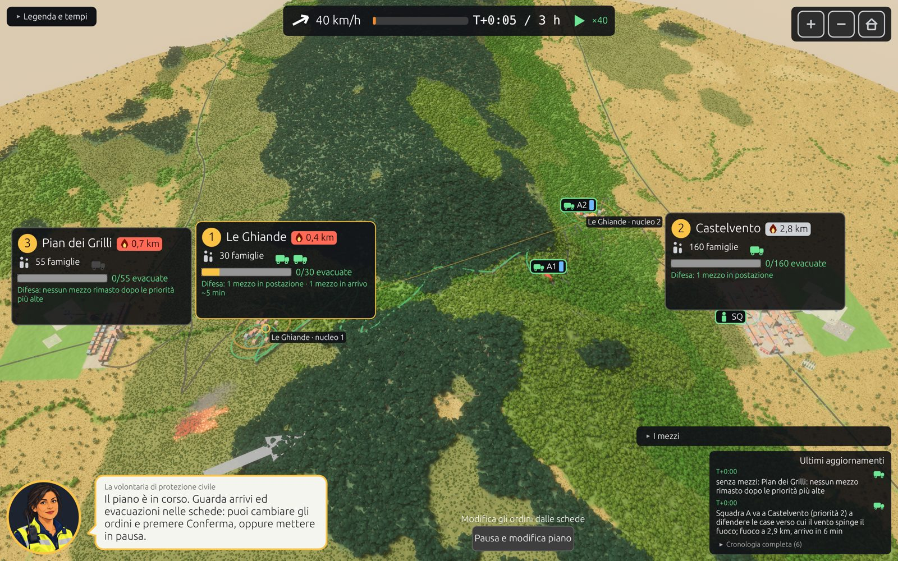
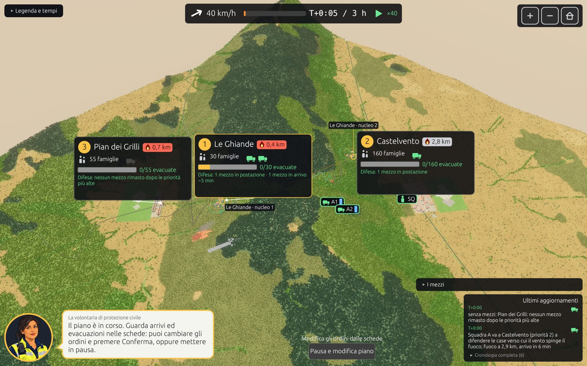
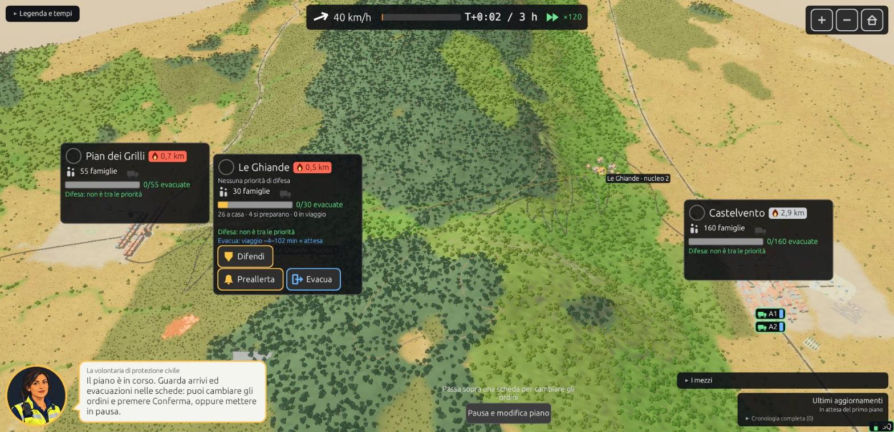

## 8. Ritmo a metà partita

- **All'avvio di ogni partita**, compreso «Altro incendio», la volontaria dice da dove parte il fuoco, il vento e verso quale paese lo spinge. Usa `near` del caso, il vento attuale e i paesi sottovento.
- **Durante Esegui**, la spiegazione del gioco resta solo per i primi 10 minuti simulati (`TUTORIAL_S`). Poi, ogni 8 s reali, la volontaria dice un fatto nuovo, a rotazione:
  - il prossimo mezzo in arrivo, con i minuti;
  - il fronte più vicino, e se il vento lo spinge lì;
  - per ogni paese con il fuoco entro 2,5 km, le famiglie ancora in casa, e se non hanno ricevuto ordini.
- Le frasi dal registro (ordini, ritirate, vento) hanno la precedenza, come prima.
- La partita scriptata (`KIOSK_SHOT`) fotografa anche T+1:40 (`3d_esegui_dopo`).

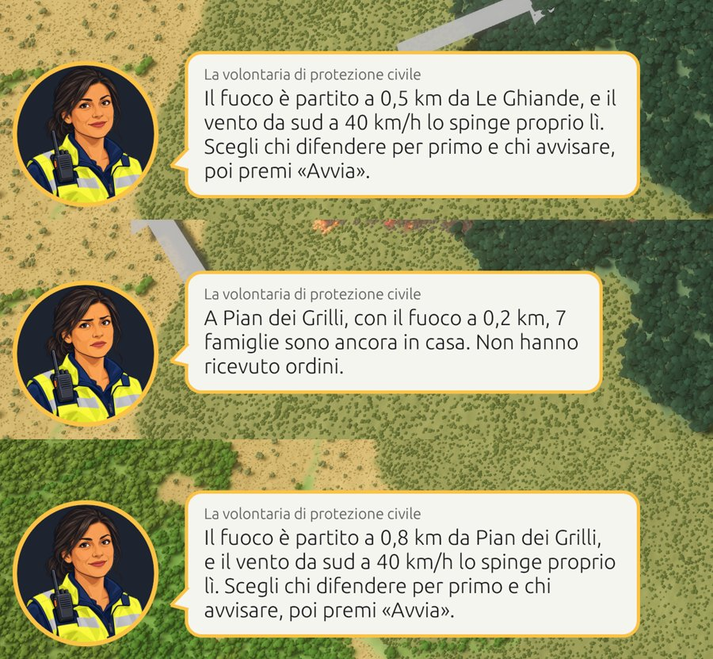

## 9. Minori

- «1 mezzo su 2», «Resta 1 mezzo».
- Le etichette dei mezzi dietro un pannello fisso (aggiornamenti, personaggio, pulsante) salgono sopra il pannello, con una linea sottile fino al mezzo.
  - La posizione viene prima riportata dentro lo schermo, come fa egui. Così si sposta anche la squadra fuori schermo in basso a destra.

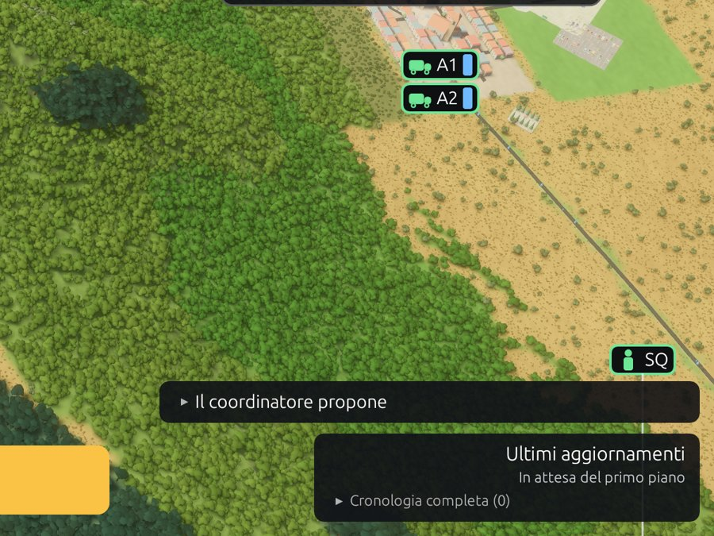

## Incognite

- **FPS nel browser non misurati:** la scheda di Chrome automatizzata era in secondo piano e veniva rallentata (0,1 frame/s). Da misurare nel playtest 3 a finestra in primo piano.
- **Touchscreen:** la scheda si apre al passaggio del puntatore. Su schermo a sfioramento va verificato che un tocco la apra (egui usa la posizione del tocco come puntatore).
- **Durata di Piano2** (1,8 min di esecuzione): forse troppo breve per seguire il fuoco. Da valutare nel playtest 3.
- **Pineta «può correre veloce»:** lo dice la tabella (v0 200 m/h). Nei casi del kiosk i fronti che arrivano ai paesi sono di erba e macchia. Da controllare che la frase non contraddica ciò che il giocatore vede.
