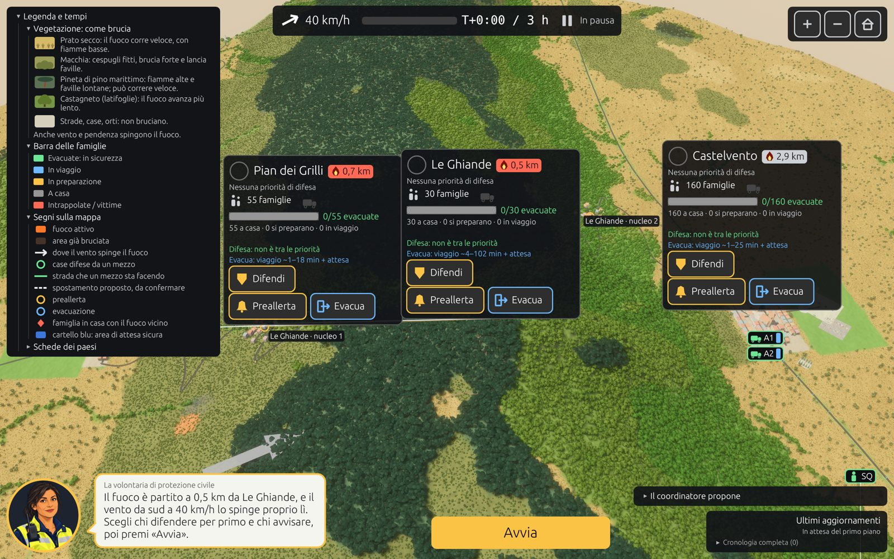
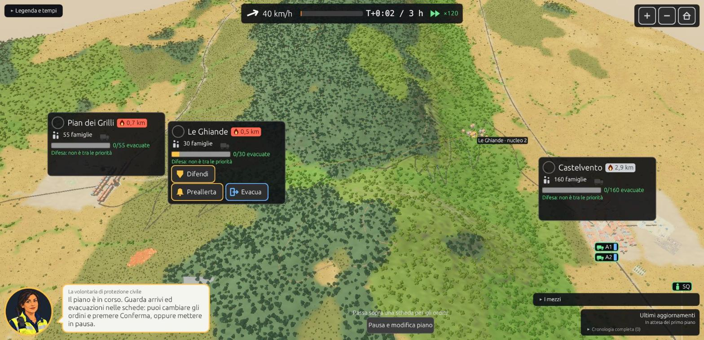
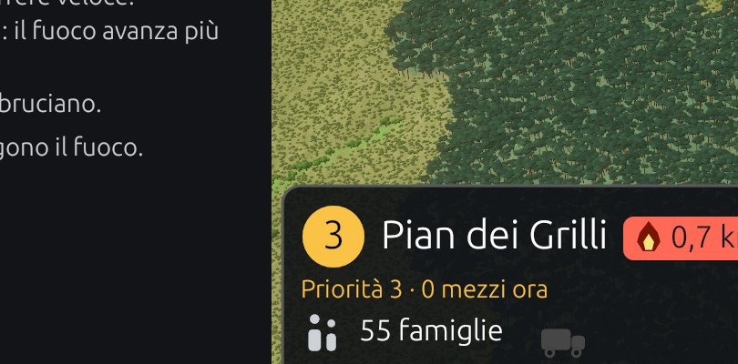

# Iterazione 5c: i primi cinque difetti del playtest 3

Decisione dell'utente (2026-10-09): «Procedi» alla proposta di correggere i punti 1–5 di `playtest_gpt3/README.md` prima del checkpoint 5.

| Punto | Correzione | File | Prova |
|---|---|---|---|
| 1. Crisi «mezzo perso» senza scelta | Ora chiede «Con i mezzi rimasti, chi difendere per primo?», con un pulsante per paese, poi «Conferma» / «Continua» | `kiosk/ui.rs` (`crisis`) | compilazione; non riprodotta nella partita scriptata (nessun mezzo perso con quel piano) |
| 2. La scheda aperta copre la scena | La scheda compatta aperta aggiunge solo i pulsanti degli ordini, senza le righe di dettaglio: circa un terzo più bassa | `kiosk/ui.rs` (`district_chips`) | browser, Le Ghiande aperta passando sopra |
| 3. Legenda tagliata | Altezza pari al contenuto, fino al 60 % dello schermo, con la barra di scorrimento sempre visibile. Le schede la evitano come gli altri pannelli fissi | `kiosk/ui.rs` (`legend`, `district_chips`) | schermata con la legenda aperta: tutte le sezioni visibili, Pian dei Grilli scoperto |
| 4. «Difendi» senza mezzi | Un paese in priorità che non riceve mezzi lo dice nella riga della priorità, in ambra: «Priorità 3 · 0 mezzi ora» | `kiosk/ui.rs` | schermata dell'anteprima |
| 5. Finale | Nuova riga «Alla fine, su 30 famiglie: 25 in salvo, 1 ancora in viaggio, 4 rimaste a casa», così i conti tornano. Le partenze si contano solo dopo l'ordine. La differenza tra preallerta ed evacuazione immediata **è rumore del seme** (`preallerta_vs_evacua.md`: medie 3,0 / 2,8 / 2,2 su 6 semi, con l'ordine che cambia) | `rocca/src/game.rs` (`story`) | test `fase3::the_story_tells_what_happened`; `debrief_righe.md` rigenerato |

**Incognite:**
- la crisi del mezzo perso con la nuova scelta va vista in una partita vera;
- i punti 6–9 del playtest 3 restano aperti (stima dell'evacuazione, frasi della sindaca, fumetto non verificato, minori).

**Proposta:** checkpoint 5, una partita al chiosco per caso.
